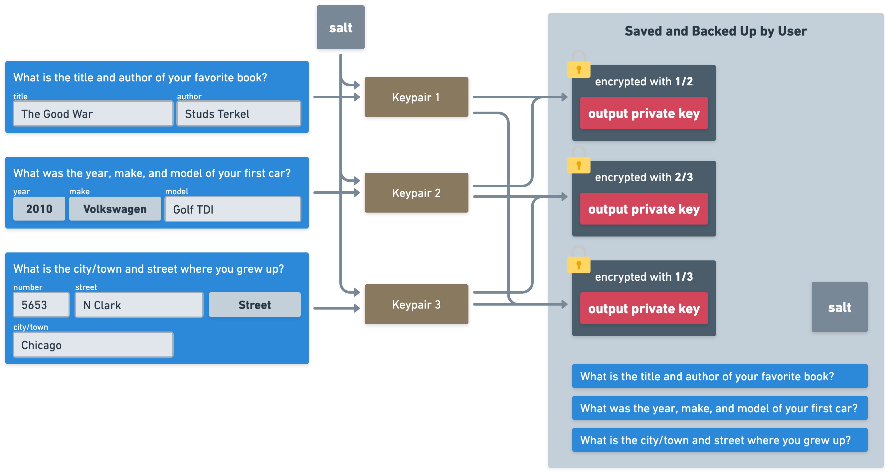

# A Decentralized Security Questions System for Cryptocurrency Key Control

Alexander Cyon, Matthew Hine

https://github.com/Sajjon/svar/yellow_paper/yellow_paper.md

4 September 2025

## Abstract

The ability for a user to personally control their own cryptocurrencies is both a blessing and a curse. Complete control of funds without an intermediary provides substantial benefits, but it comes with the full responsibility to protect the means of controlling those funds. We propose a cryptographic method of *decentralized security questions* that can in part relieve the burden of this responsibility within modern cryptocurrency systems without sacrificing true self-sovereign control.

## Introduction

Control of crypto funds always ultimately comes down to control of cryptographic key pairs, or more specifically the private keys the user alone holds to prove they are the owner. Traditionally, each crypto account is controlled by a single private key. In fact an “account” is typically nothing more than a public address derived from the key pair that token ownership can be associated to.

More recent systems and proposals (such as threshold signatures, Ethereum's ERC-4337 “account abstraction”, and Radix's “smart accounts”) allow use of multiple private keys in multi-signature configurations to control crypto accounts so that a single private key is not necessarily granted full control of the account. However, even in multi-signatures systems, in order to maintain personal control of crypto funds without an intermediary, personal control of private keys in some form is still required and the technical complexity remains.

The technical complexity of securely protecting and using private keys has led to frequent loss of cryptocurrencies. Private keys created with sufficient entropy to be secure are far too long to memorize, and difficult for the common user to manage safely. The use of "mnemonic" phrases, such as BIP39, attempt to express private keys in a form that is more human readable and memorable, but asking a user to memorize 12 or more words is still unrealistic. Even in the web2 world of simple login passwords, users are so bad at managing passwords that websites are rapidly moving toward *Passkeys*, a system that relieves the user of the password burden but at the cost of introducing an intermediary that must be trusted.

The common user also is used to bank and webpage logins where they can always forget a password and can still recover access through other means. With cryptocurrencies, even if using a BIP39 mnemonic phrase, losing a single word means total unrecoverable loss of funds.

To help bridge this gap for users, we propose a method to produce a private key from information already known and memorable to the user, in a way that is reliable and secure enough to be used as part of a robust multi-signature structure. This method allows a user to have personal control of a private key without having to protect a lengthy key or mnemonic phrase, and allows a user to forget some information and still retain access to the key.

Notably, we do **not** propose that this method is sufficiently secure to produce the *exclusive* or *primary* private key used to control a crypto account. While the method formally provides sufficient entropy to provide sufficient protection against brute forcing, it is more susceptible to social engineering-style attacks than typical private keys. Therefore the method described in this paper is proposed for use as a *secondary* private key used within multi-signature systems (such as those mentioned above). An example of such a usage is provided.

## The Decentralized Security Questions Method

Our proposal makes use of a common pattern in traditional authentication: a set of personal questions that the user already knows the answers to and is likely to continue to remember, such as *"What was your favorite band in high school?"* In traditional systems, the user typically chooses from a set of potential questions and furnishes their answers, which are saved in a backend database.

This is a useful authentication pattern because it doesn't require the user to create a password (which may be poorly chosen) or write one down (which may be stored insecurely). It also has the benefit of using multiple questions, potentially allowing the user to fail to answer a question incorrectly as long as they can correctly answer others, making it a very reliable method of authentication (*reliable* in the sense that the user is very likely to maintain access even with fallible memory).

We propose to keep these benefits of a traditional security questions authentication, while adapting it so that it can produce a private key of sufficient cryptographic security for use in controlling a cryptocurrency account.

In short: We propose to do this by starting with a set of well-chosen security questions and *structured* answers to those questions. The questions and answers are combined to produce sufficient entropy to be used for encryption. Multiple *combinations* of these entropies are then used to encrypt *multiple copies* of a secret. That secret can then be used to derive key pairs that can be used to create and control a cryptocurrency account (typically as part of a multi-key system in practice).

The diagram shows an example configuration where the user has set up 3 security questions and answers, and must later correctly answer 2 of the 3 when they need to use the output private key.

The resulting experience for the user is:

* Key creation is simply choosing questions and furnishing answers
* Key usage only requires answering a required minimum number of questions correctly, allowing for fallible memory
* The derived entropies, secret, and anything derived from the secret never need to be seen or manually managed

Breaking down the parts of the system, we propose the following:

### Security questions and structured answers

Each security question and its answer, along with suitable cryptographic salt, produces a keypair used by the system for encryption. However, to be suitable for this task, we must carefully choose and structure the questions and answers appropriately.

We should not use the traditional, simple unstructured style of security question. Letting users freely type their full answer to any security question into a single text field has multiple problems. First, it allows the user to type in a lazy, short answer that is easily guessed. But also, it introduces many possible ambiguities. For example, when asked for a street address, do you type "Main Street" or "Main St." or "main st"? This isn't such a problem in a traditional system where typically a human is asking the questions and can judge if the user "basically got it right" before unlocking their account. But if we want to use these answers as the part of the precise seed for a keypair; we can't afford any ambiguity.

We propose solving this with the following system requirements:

* Choose questions where the answers can be broken up into logical parts that force the user to provide multiple inputs, and where the range of possible answers provides sufficient entropy.
* Use a selection of options, rather than a text field, for any parts of the answer that can be covered well in this way. For example, rather than expect the user to type "street" or "St.", offer a (long) menu of options like Street, Road, Lane, etc.
* For parts of the answer that do use a text field, process it to remove spaces, punctuation, and capitalization.

To take the example in the diagram above, we might offer the question *“What was the year, make, and model of your first car?”* The three elements of the question allow us to break up the answer into three distinct parts. For “year” and “make”, we can even offer answers as selection lists of all possible years and auto manufacturers so that there can be no ambiguity, leaving only the “model” as freeform text. Then, the processing on that answer can reduce the example answer to “golftdi” so that later variations in the answer like “Golf TDI”, “golf tdi”, or “GOLF TDi” are all correct.

### Multiple encryptions of the secret

Each question, its correct answer, and suitable salt can be combined to produce an *entropy*. We can use those to entropies to protect our single secret, in a way that makes it recoverable using only a subset of the full list of questions/answers.

To do this, we create multiple encryptions of the secret, each using a different combination of a subset of the full set of entropies we have available. The secret can later be decrypted if we can re-produce enough questions/answers (and the salt) to recover the set of entropies used for at least one of the encryptions of the secret. By choosing a number of entropies for each encryption less than the total number available, we make it possible to recover the secret with the level of failsafe-ness we desire for the user.

For example, if we want to ask 3 questions but allow the user to answer any 2, we encrypt the secret with every possible combination of 2 question/answer entropies – 3 combinations in this case. This means that success in answering at least any 2 of the questions will allow one of the encryptions to be decrypted and the secret recovered (for the duration of its required use, and then forgotten).

In a real system design, the choice of the number of questions, and the required number of correctly-answered questions (resulting in the number of encryptions of the secret), should strike a suitable balance between increased security (more questions, fewer incorrect answers allowed) and increased reliability (fewer questions, more incorrect answers allowed). This choice may be influenced by things like the guessability of the questions/answers for the users in question, and how the secret is used to derive keys for the account’s multi-signature structure.

### Saved data in the user's wallet

To create a usable system, the implementation should include a wallet application that stores some required data for the user so that it can be used automatically by the wallet, and so the user need not independently manage it, including:

* Each of the encryptions of the secret
* The salt used to create the question/answer entropies
* The list of questions, and structure of their answers, corresponding to the entropies created

***Note: The last is particularly important if the implementation allows the user to choose the questions to answer from a larger list, so that they need not remember which questions they answered. It may also be important if, in the implementation, the list of questions available to the user may be later modified.***

With these pieces of data, a wallet may perform the authentication by offering the questions, using the answers and salt to decrypt at least one of the encryptions, and recovering the secret temporarily for use.

This does put some burden on the wallet software. Crypto wallets typically assume the idea that the user has written down their private key (or corresponding mnemonic seed phrase) and so that is the only information required to recover access. With the decentralized security questions concept, the wallet software has a responsibility to save the additional information that enables easy use of authentication using the security questions. That likely should include a backup mechanism of some kind to ensure access to this data even if, for example, a phone is lost.

The idea of backing up this data (perhaps even in the cloud) sounds concerning on the surface. However, note that the package of data is not "security critical" on its own. If an attacker is able to access this data, they have no ability to make use of the encryptions of the secret without finding the correct answers to the security questions. With sufficient entropy in the implementation's choice of questions and structured answers (to make brute-forcing impractical), the best they have achieved is narrowing down the list of questions to answer for a social engineering attack, if they are able to research the answers for the user in question or phish the answers from them.

While this means that cryptographic security is maintained in the case of a revealed data package, it does mean that the secret the system protects should be considered "more compromised" than if the secret was never input into the system whatsoever.

This is the primary reason that we do **not** recommend this system be used to protect a private key that wields *exclusive* or *primary* control over an account, but rather as a secondary "factor" in a multi-signature scheme. One particularly good use may be in systems where a specific set of factors is used only for "recovery" of an account – similar to the traditional use case of calling your bank and reciting answers to your questions to prove who you are if you need to change your password. We'll briefly describe such a system now.

## An Example Multi-sig System Use

Even in traditional systems, a set of personal questions is never used as the sole method of authentication. Answering these questions would be too burdensome for everyday logging in and potentially too prone to social engineering, so a password is still typically used. But if the user can't produce their password, or their identity is in doubt, they can answer these questions (often speaking to a human on the phone who can interpret the answers) to prove who they are and recover access.

Similarly, we can use decentralized security questions not for the *primary* private key used for everyday cryptocurrency account access, but as a *secondary* factor used as part of recovery of access. This may, for example, enable the *primary* key to be one that is secure but *losable*, such as a key stored securely on a mobile phone. If the primary key is lost (perhaps by losing a phone), decentralized security questions may be used as part of a multi-signature method to update the account to use a different primary key.

We can describe such a system using some features of the [Radix Network](https://www.radixdlt.com/), which has some unique technical features for taking advantage of this sort of option.

The Radix Network includes ["smart accounts"](https://learn.radixdlt.com/article/what-are-smart-accounts) – essentially smart contracts that act as accounts that hold user tokens and can include multi-signature logic to define how those accounts may be used in various ways. One of the ways Radix uses this capability is the possibility of having different "roles" for smart accounts that have different rights and are controlled by different sets of private keys.

In the Radix concept, a "primary" role is the set of private keys that can (among other things) withdraw assets from the account. However, there are also "recovery" and "confirmation" roles that can be used in concert if the user loses access to the keys of their primary role. The recovery and confirmation roles may use sources of private keys ("factors") that would normally be inconvenient to use, but work well in the unusual circumstance of a lost primary role. A high level of security can be maintained by requiring **both** the recovery and confirmation roles to act to perform the multi-sig structure update.

In this context, decentralized security questions may be a good candidate for use with Radix’s *recovery* role, with the confirmation role perhaps controlled by another trusted user's wallet. This "social recovery" choice would not be suitable for the primary role as you may not trust your friend with the ability to withdraw your funds, but is good when combined with our set of security questions that only the user themselves can answer.

In this sort of usage, an attacker who wants to use the recovery mechanism to steal funds would need to:

* Somehow gain access to the security questions, and salt, the user has used
* Guess their answers to the questions (perhaps with research or social engineering for a dedicated attacker)
* Also compromise the wallet of the trusted contact, to use that factor in concert with the security questions

This is a very different security model than the one typically used in crypto today where one key always fully controls the account forever, but is one that we think points the way to making crypto usable to the common user without compromising on full personal control.

## Technical Specification

In this section we will present how the cryptographic mechanisms of decentralized security questions work.

We start by noting that the scheme we propose is, in fact, an *encryption* scheme used to secure a **secret**, typically a BIP39 mnemonic (or bare private key) that can be used to derive keys for use in authentication with PKI. Thus, we will focus on the unique encryption and decryption operations of our scheme in this section, and not how signing works.

### Encryption

Assume the software has already generated a **secret** – typically a BIP39 mnemonic – that must be protected, but also be reliably retrieved by the user. This is the “output private key” described above.

We will encrypt `secret` after the user has chosen a few security questions that they feel will have memorable answers. For example, the user might not choose the question *“What was your favorite ice hockey team when you were 15?”* if she didn’t care about sports then.

Let `n` be the number of questions the user chooses and must provide answers for. For example, if there are 20 questions but the user is required to choose 4 that are relevant, then `n=4`.

We proceed as follows to encrypt `secret` to produce a `sealed_secret` that can be later decrypted for use.

#### Procedure

1. The user provides `n` answers `a0`, `a1`, ..., `a_n-1` to the `n` questions; `q0`, `q1`, ..., `q_n-1`, using some appropriate UI (order does not matter, we will see later why).
2. We generate `n` salts, `s_0`, `s_1`, ... `s_n-1`
3. We derive `n` entropies, being byte arrays (32 bytes), using a function `ent_from_qas(answer, question, salt) ->[u8; 32]`; `e_0 = ent_from_qas(a_0, q_0, s_0)`, ..., `e_n-1 = ent_from_qas(a_n-1, q_n-1, s_n-1)`.
    1. This function will be described later.
    2. We call these "entropies" since the salt is random and we use this later to form encryption keys (while of course the users’ questions and answers are not random, even if very difficult to guess).
4. We form `n choose m` (where `m < n`) [combinations](https://en.wikipedia.org/wiki/Combination) of entropies, which will allow for the user to later answer `n - m` questions *incorrectly* and still reproduce a combination useful for decryption.
    1. For example, for `n = 8`, `m = 6`, `n choose m = 8 choose 6 = 28`. So there would be 28 different combinations allowing the user to incorrectly answer `8 - 6 = 2` questions.
    2. Each `n choose m` combination is a set with `m` many byte arrays, e.g. `c_0 = Set([e_0, e_1, e_2, e_3, e_4, e_5, e_6, e_7]), c_1 = Set([e_1, e_2, e_3, e_4, e_5, e_6, e_7, e_8])` etc. 
5. We reduce each combination, `c_0`, `c_1`, ..., `c_n_choose_m-1`, into a single 32 bytes array, by performing [bitwise XOR](https://en.wikipedia.org/wiki/Bitwise_operation#XOR) between each bit in each entropy with a function `reduce_combination(combination: Set<[u8; 32]>) -> [u8; 32]`.
    1. We note the combinations form an [Abelian Group](https://en.wikipedia.org/wiki/Abelian_group) under XOR, meaning that the order of the entropies in the combination set does not matter, since XOR produces the same result regardless of order. This is an important property, allowing us to prompt the user to answer questions *in any order* in the future, allowing for both a more robust and secure system by making it harder for keyloggers to attack it.
    2. Reducing `n choose m` many combinations of entropies yields `n choose m` many 32 byte array outputs from the `reduce_combination` function
6. Use the byte arrays from `reduce_combination` to form (symmetric) encryption keys, `k_0`, `k_1`, ..., `k_n_choose_m-1`.
7. With each encryption key, encrypt `secret` using a safe encryption scheme, typically [AES](https://en.wikipedia.org/wiki/Advanced_Encryption_Standard) (GCM-256), each with a generated nonce and tag, outputting a ciphertext. Save `nonce || tag || ciphertext`, letting `||` denote byte concatenation, for each encryption.
8. The final `sealed_secret` consists of the `n` many `(question, salt)` tuples, the `n choose m` many encryptions (`nonce || tag || ciphertext`).

#### Implementation of an `ent_from_qas` function

This function derives 32 bytes of entropy from the tuple (Question, Answer, Salt) with the approach used depending on what *kind* of answer is used to answer the question. Earlier we talked about the advantages that *structured* questions have over freeform answers, but for completeness we show how the implementation of `ent_from_qas` might look like for both kinds:

##### `ent_from_freeform_qas`

This function maps a freeform answer like "221B Baker street" to a question like *"On which street did you live when you were 5?"* into entropy (32 bytes).

The function operates as follows.

* Transform the freeform answer by `transformed_answer = lowercase(answer.replace([' ', '"', '-', '\''], with: '').encode(.utf8)`
* Then we run it through a Hash-based Key-Derivivation-Function \- [HKDF](https://en.wikipedia.org/wiki/HKDF), like so: `HKDF256(transformed_answer, salt, question_info)`...
* ... where `question_info` can be some variant of `(questionID, questionVersion)`, if we imagine we have given all questions an ID and versioned them (so we can adjust exact phrasing). Or it could possibly be the same kind of transform we do with the answer.

##### `ent_from_structured_qas`

This function derives 32 bytes of entropy from a tuple `(Question, Answer, Salt)`, where an Answer might be several indices of datasets of possible answers.

For example, the question "What was the first video game you owned?" can be answered by using dropdown menus: first you select a *manufacturer (*"Nintendo", "Sony", "Sega" etc). Then you select a *console* (if you selected "Nintendo" you get to choose console "NES", "Gameboy", "SNES" etc) Finally you choose a *game* from a list of all games for that *manufacturer* and *console* ( "Super Mario Bros", "Super Metroid", "The legend of Zelda a Link to the Past" etc.)

Answers provided in this way are structured rather than freeform. In the example, the recorded answers are not the strings "Nintendo", "SNES", "Super Metroid". Instead they are the index of "Nintendo" in the list of manufacturers (index 0), then the index of "SNES" in the list of Nintendo consoles (index 2), and then the index of "Super Metroid" in the list of SNES games (index 2), resulting in a structured answer of `(0, 2, 2)`.

(As a UX note, in a usable interface, these dropdown selection lists should be searchable, otherwise it would be infeasible to find the right answer amongst thousands or even tens of thousands of options.)

The function operates as follows.

* Lookup the index of each partial answer from the dataset of possible answers (giving `(0, 2, 2)` in the example above)
* Let's assume we prompt the user to select amongst more than 65536 choices, allowing us to represent each index as a UInt16, occupying 2 bytes, encode the answers as Big Endian bytes (e.g. `(0, 2, 2) = 0x000202)`, and let that be the `transformed_answer`
* Follow `ent_from_freeform_qas` above and run the `transformed_answer` through HKDF.

### Decryption

Decryption is the inverse of encryption, using the `sealed_secret`, which includes:

* `n` many `(question, salt)` tuples
* `n choose m` many encryptions (`nonce || tag || ciphertext`)

As the user furnishes a sufficient number of answers to the questions, we can reproduce the corresponding encryption keys and try to decrypt the `n choose m` many encryptions, each using all of the encryption keys (`n * (n choose m)`). For an example `sealed_secret` of `n=8`, `m=6` the number of encryptions is 224 – a tiny number for any computer from a performance perspective.

At the first combination of `(encryptionKey, encryptedSecret)` which succeeds, we can return the decrypted `secret` for use in the software. If all `n * (n choose m)` combinations fail, the user has answered more than `m - n` questions incorrectly – a circumstance which should hopefully be unlikely for well-chosen values of n and m that balance safety with the fallibility of human memoryProcedure.

1. Prompt the user to answer the `n` questions, which are read from the `sealed_secret`, in a random order (which is safest), let the user answer all questions.
2. Form the `n` many tuples (Question, Answer, Salt) by reading the salt from `sealed_secret` looked up by using question
3. Repeat step 3-6 of encryption procedure to derive the (symmetric)encryption keys, `k_0`, `k_1`, ..., `k_n_choose_m-1`
4. For each encryption key try to decrypt all of the encryptions (`nonce || tag || ciphertext`), if any combination succeeds, return the decrypted `secret`. If all combination fail, user has incorrectly answer too many questions

## Reference Code

An open source reference implementation of the decentralized security questions concept is provided here:

[https://github.com/sajjon/svar](https://github.com/sajjon/svar)

Included is a [simple CLI application](https://github.com/Sajjon/svar/blob/main/crates/cli/README.md) that can be used to play with the concept from a user’s perspective.